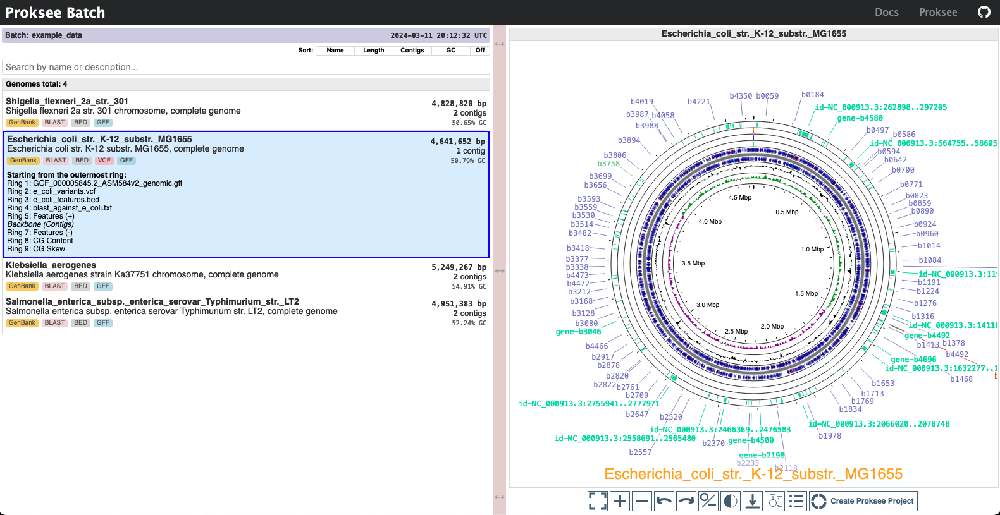

# Usage

```{eval-rst}
.. click:: proksee_batch.__main__:main
    :prog: proksee-batch
    :nested: full
```

## Input

The top-level directory, referred to as `input_directory`, may contain multiple
subdirectories. Each subdirectory contains files associated with a particular
genome assembly. Within each of these genome-specific subdirectories, there are
several other subdirectories, each dedicated to different types of genomic data.
These include `genbank`, `fasta`, `blast`, `bed`, `json`, `vcf`, and `gff`.

For example, the following is a minimal yet valid input directory structure
for two genomes:

```text
input_directory
├── genome1
│   └── genbank
│       └── genome1.gbk
└── genome2
    └── fasta
        └── genome2.fna
```

Below is a more complex example of an input directory structure containing two
genomes, each with annotation files of various types:

```text
input_directory
├── genome1
│   ├── genbank
│   │   └── genome1.gbk
│   ├── blast
│   │   ├── genome1_blast1.txt
│   │   └── genome1_blast2.txt
│   ├── bed
│   │   └── genome1_features.bed
│   ├── json
│   │   └── genome1_styling.json
│   ├── vcf
│   │   └── genome1_variants.vcf
│   ├── gff
│   │   └── genome1_features.gff
│   └── metadata
│       └── genome_1_metadata.json
└── genome2
    ├── fasta
    │   └── genome2.fasta
    ├── blast
    │   └── genome2_blast.txt
    ├── bed
    │   └── genome2_features.bed
    ├── json
    │   └── genome2_styling.json
    ├── vcf
    │   └── genome2_variants.vcf
    ├── gff
    │   └── genome2_features.gff
    └── metadata
        └── genome2_metadata.json
```

In addition, the command-line option `--download-example-data` can be used to
generate an example input directory with all valid input file types.

### Specific Subdirectory and File Requirements

#### 1. **Genbank Directory**

- **Purpose**: Contains a GenBank file containing records for each contig in the genome assembly.
- **File Requirements**: A single GenBank file with extensions `.gbk`,
  `.gbff`, or `.gb`. This file is mandatory unless a FASTA file is provided.

#### 2. **FASTA Directory**

- **Purpose**: Stores genomic DNA sequences in FASTA format. This is only
  used if no GenBank file is provided.
- **File Requirements**: A single FASTA file with extensions `.fna`, `.fa`,
  or `.fasta`. This directory is considered only if the GenBank directory is
  absent.

#### 3. **BLAST Directory**

- **Purpose**: Contains the results of BLASTN or TBLASTN searches against the genome assembly.
- **File Requirements**: Files with `.txt` or `.tsv` extensions in BLAST
  outfmt6 format. Note: Any search program that outputs search/alignment
  results in BLAST outfmt6 format can be used.

#### 4. **BED Directory**

- **Purpose**: Contains BED files describing the locations of genomic features.
- **File Requirements**: Files with the `.bed` extension.

#### 5. **JSON Directory**

- **Purpose**: Contains a custom Proksee project JSON file for visualization templates.
- **File Requirements**: Files with the `.json` extension.
- **How to Create a JSON File**: The JSON file can be created using the
  Proksee web application. To do this, go to [Proksee](www.proksee.ca), create
  a new project, customize the visualization styling, and then under the
  "Download" options select "JSON (Reloadable Map Data)" and download the
  `.json` file. See the [Proksee documentation](https://proksee.ca/help) for
  more details.

#### 6. **VCF Directory**

- **Purpose**: Contains Variant Call Format (VCF) files for describing
  genomic variants.
- **File Requirements**: Files with the `.vcf` extension. All the sequence
  (chromosome) IDs in the VCF file must match the sequence (contig) IDs in the
  GenBank or FASTA file, and the REF genotypes in the VCF file must match the
  genotypes in the genome file.

#### 7. **GFF Directory**

- **Purpose**: Contains General Feature Format (GFF) files, used for
  describing genes and other features.
- **File Requirements**: Files with `.gff` or `.gff3` extensions.

#### 8. **Metadata Directory**

- **Purpose**: Contains a metadata file in JSON format, used for assigning
  custom descriptions to genomes (instead of using descriptions from the first
  sequence of the input GenBank or FASTA file).
- **File Requirements**: One file with the `.json` extension. Must define a JSON object of the form:
  ```json
  {
    "metadata": {
      "description": "Custom description for the genome"
    }
  }
  ```

## Output

### Output Directory Structure

- **Data Subdirectory (data/)**: This folder contains a `table_data.js` file
  with data which is tabulated in the HTML report. This folder also contains a
  `genome_maps` subdirectory with CGView map data files for each input genome.
  These are loaded as necessary to visualize genomes via the HTML report. Each
  file is named following the pattern `genome_N.js`, where _N_ is an arbitrarily
  assigned number.

- **CGView JavaScript Code Subdirectory (cgview-js_code/)**: This folder
  contains the necessary JavaScript code from the
  [CGView.js](https://js.cgview.ca/) project, which is necessary for the
  interactive genome viewer in the HTML report.

- **HTML Report**: A single HTML file is generated in the root of the output
  directory. This file serves as an interactive report summarizing the information
  and visualization for the genomes processed, and can be opened in any web
  browser. _Note_: This is _not_ a standalone file--It requires the `cgview-js_code`
  and `data` subdirectories to be present in the same directory as the HTML file.

### The HTML Report

The HTML report consists of an interactive data table on the left side, and an
interactive genome viewer on the right side. The data table contains a row for
each input genome identified by ID as well as size (bp), number of contigs, and
GC content. This table also contains links to visualize and analyze the genome
via the Proksee web application. The table can by sorted by column values by
clicking on the column headers. When a row is clicked, the genome viewer window
on the right side of the page is updated to display the genome data for the
selected genome. Like [Proksee](www.proksee.ca), the genome viewer is generated
using [CGView.js](https://js.cgview.ca/), so the features and controls are
similar. The built-in genome viewer can be used for basic visualization, and
includes GC content and GC skew plots, but does not offer the options for
further analysis that are available in the Proksee web application.

The screenshot below shows an example of the HTML report generated by Proksee
Batch.


